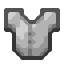
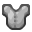

# RealisticPNG
Makes Pixelart semi-realistic. Adapted from sullerandras/terraria-hd-textures
Doubles the size of any png, and grabs pixels from corners and areas around it to make smoother corners and edges.

**All Credit goes to Sullerandras, he created this for a smooth terraria texture pack, and the program is the main portion of it.**

**Origin of my findings: [forums.terraria.org](https://forums.terraria.org/index.php?threads/enhanced-version-of-the-textures-of-terraria-1-3-0-8.39115/)**

As seen from this example:
I took the same chestplate image, exactly the same, but in two different resolutions I used the program:

Original: 

Program used on the 32x32 Doubled one (Custom Resolution): 

Program used on the 16x16 (Original Resolution): 

----

How do I use it??

Simply place your picture next to the "SmushImages.exe" in the folder.
From a CLI like cmd, call `SmushImages.exe "XBR" -wrap input.png output.png`.
Rename `input.png` and `output.png` to whatever you want.
or just place the picture in the folder, rename it to input, and run the batch file in there.
